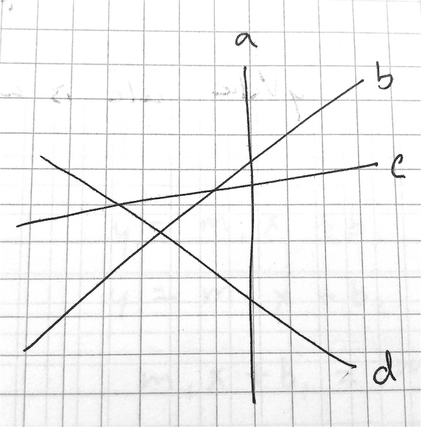
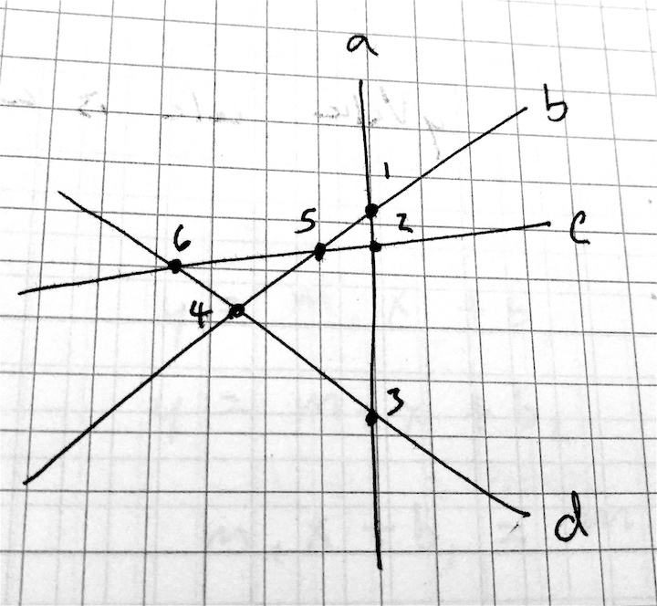
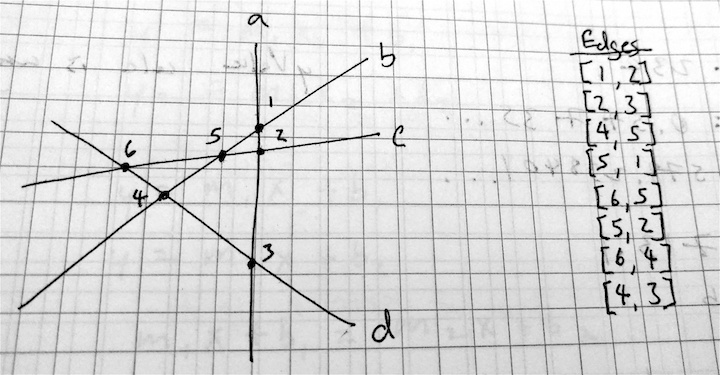
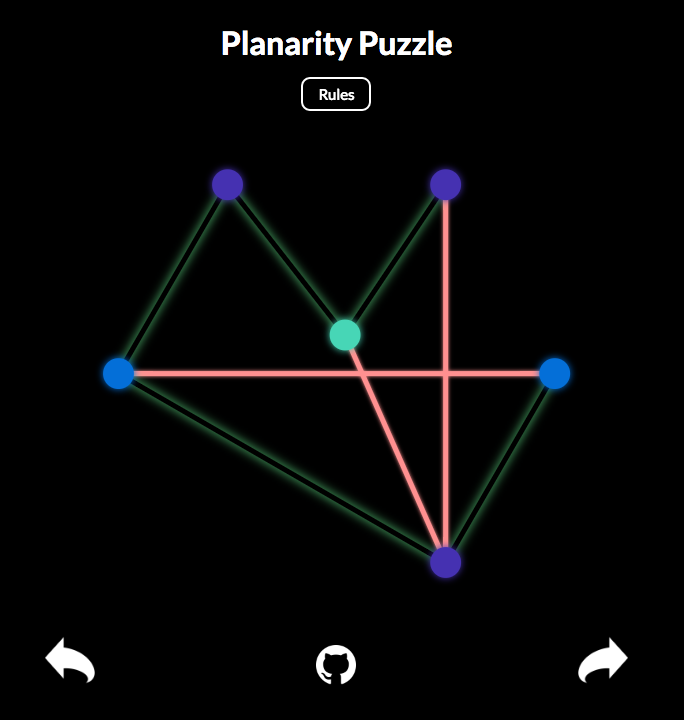
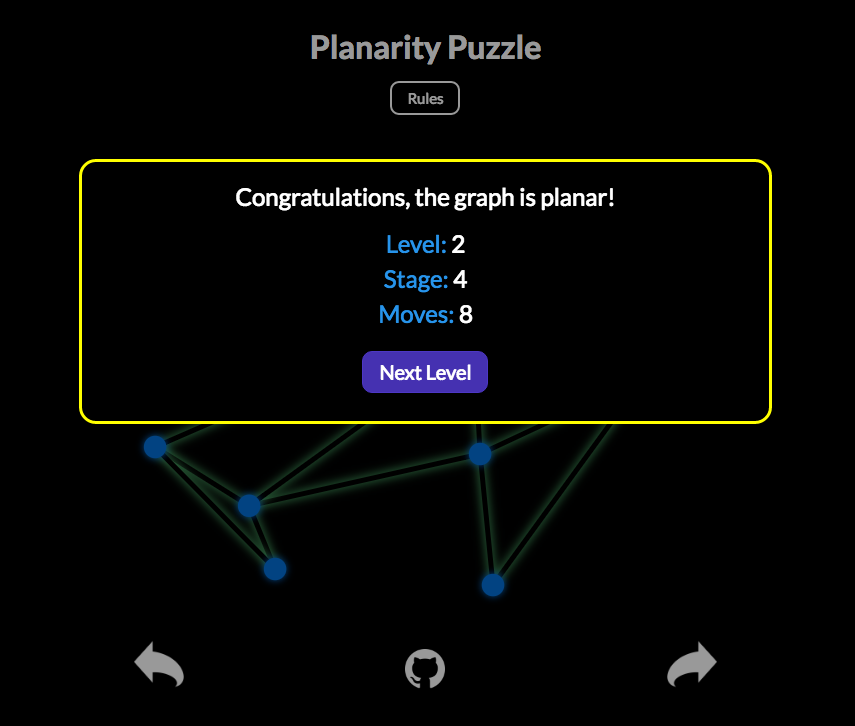
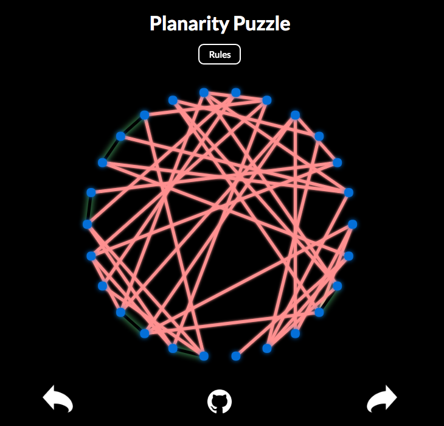

# Planarity Puzzle

[Planarity Puzzle live][gh-pages]

[gh-pages]: https://joyjing1.github.io/Planarity/

Planarity is a mathematical brain teaser that challenges the player to transform a graph into its planar representation. It is built entirely in JavaScript and utilizes jQuery and Canvas to interact with the player. [Planar Graphs][planar-wiki] are sets of edges and vertices where the edges intersect only at their endpoints.

[planar-wiki]: https://en.wikipedia.org/wiki/Planar_graph


## Features & Implementation

### Generating Planar Graphs

The game generates a new random graph at the beginning of each level. Determining whether a graph is planar is a non-trivial matter, so I modified an algorithm by [John Tantalo][john-tantalo]. My algorithm starts with a minimum of 4 non-parallel lines.

[john-tantalo]: http://johntantalo.com/wiki/Planarity/


All n(n-1)/2 intersections are labelled as vertices, and the edges between neighboring vertices are recorded as the edges of the final graph.




This process translates into the following JavaScript code:

```javascript

  generateEdges(n) {
    // Build pairIndex hash from { [pair]: indexOfVertex }
    let pairIndex = this.pairIndex(n);

    // Generate n * (n-1)/2 random lines of differing slope
    const lines = this.generateLines(n);

    // For each line, find the intersection points
    // of that line with all other lines
    let edges = [];
    lines.forEach( (line1, i1) => {
      let intersections = [];

      lines.forEach( (line2, i2) => {
        if (i1 !== i2) {
          let intersection = line1.intersectsAtX(line2);
          intersections.push( { x: intersection, lineIdx: i2 } );
        }

      });

      // Order lines by intersection point's x-coordinate
      intersections.sort( (intersect1, intersect2) => {
        return intersect1.x - intersect2.x;
      });

      // For each pair of neighboring intersections
      // create a new edge between them
      for (let i = 0; i < intersections.length-1; i++) {
        let l1 = intersections[i];
        let l2 = intersections[i+1];

        let indices1 = [i1, l1.lineIdx];
        let indices2 = [i1, l2.lineIdx];

        indices1.sort( (a, b) => a-b  );
        indices2.sort( (a, b) => a-b  );

        let v1 = pairIndex[indices1];
        let v2 = pairIndex[indices2];

        edges.push([v1, v2]);
      }

    });

    return edges;
  }
```

Because this process adds n-1 vertices for every increase in `level`, I created intermediary `stages` that only add only one new vertex per stage. To do so, I start with a planar graph associated with the next level, then remove `(n-1) - s` vertices (and their associated edges). Because stages begin at stage 0, I adjust with a `+1`.

```javascript
numVertices = (n * (n-1)/2) - (n-1) + this.stage + 1;
```

### Edge Crossing Determination

I categorized edge crossings into four possible situations:
1. The edges were parallel - did not cross
2. The two edges shared a vertex
3. One of the edges was horizontal or vertical
4. Both edges were diagonal and did not share a vertex

#### Share a Vertex
Two edges that share a vertex will only intersect if they have the same slope, as calculated from the shared vertex. For this scenario, I used a `Util` function that calculates slope given an ordered pair of vertices.

```javascript
slope(vertex1, vertex2) {
  return (vertex2.y - vertex1.y) / (vertex2.x - vertex1.x);
}
```

#### Horizontal/Vertical Lines
If one of the lines was horizontal, I calculated whether the y-coordinate fell in the y-range of the other edge. If it did, I calculated the corresponding x-coordinate, and determined whether it fell in the x-range of the horizontal line. Vertical lines were treated in a similar fashion.

#### Diagonal Lines
Two non-parallel lines will always intersect at exactly one point. For two diagonal edges, I calculated the (x, y) point at which they should intersect. To determine whether the two edges crossed, I calculated whether that (x, y) point was on both of the relevant edges using the following code:

```javascript
const x = this.intersectsAtX(edge);
const y = this.yValue(x);

const xWithinRange = (this.minX()+1 < x && x < this.maxX()-1 && edge.minX()+1 < x && x < edge.maxX()-1);
const yWithinRange = (this.minY()+1 < y && y < this.maxY()-1 && edge.minY()+1 < y && y < edge.maxY()-1);

return xWithinRange && yWithinRange;
```

### User Interaction

I used HTML Canvas to draw the edges and vertices, and added `mousedown`, `mouseup`, and `mousemove` handlers to determine when a user clicks on a vertex and draggs it to another position. I change the color of the edges based on whether they are currently crossed or free, to make the game more intuitive for a player who may not know what a planar graph is. I also change the color of the vertices based on whether the user is currently moving it, or if it is neighboring the currently selected vertex.



When the graph is a planar, a modal pops up to congratulate the player and displays the number of moves the player took to solve the puzzle, as well as the current level and stage.



I also provide buttons in the bottom corners to allow a user to fast-forward through levels, or move back to previous levels. The easiest level has 6 nodes, and the most difficult can have an infinite number of vertices.



### Responsive Web Design

To make the game playable on screens of any size, I set the width and height of the canvas based on the window size. I made the canvas is square, to guarantee that the vertices will be distributed evenly and in a polygonal fashion.

The radius of the vertices is determined based on the proportion of the window size and the number of vertices, with a minimum of 5 pixels.

```javascript
Game.prototype.setVertexSize = function() {
  Vertex.RADIUS = (Game.DIM_X / this.vertices.length / 10) + 5;
};
```

### Mobile Capabilities

I included `touchstart`, `touchend`, and `touchmove` event handlers to allow users to play the game on their phone. The game currently works well on Android phones, but sometimes has difficulty rendering on iPhones.

Future optimizations will include increasing the vertex radius on devices with small screens.
